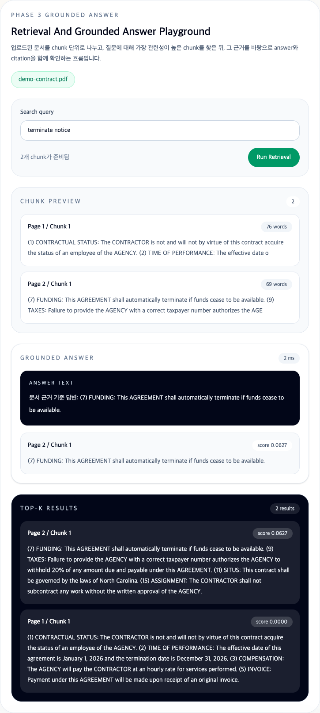
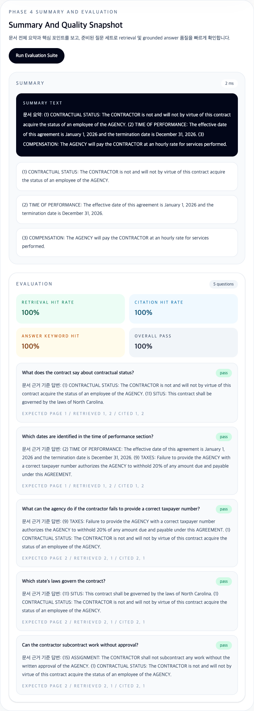
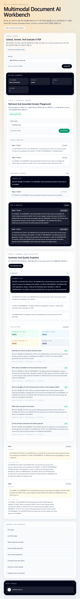

# Results

Status: Phase 5 baseline evidence  
Last Updated: 2026-03-13

## 1. Demo Scenario

이번 포트폴리오 데모는 공개 가능한 계약서 스타일 샘플 문서를 기준으로 아래 흐름을 검증한다.

1. PDF 업로드
2. 페이지별 텍스트 파싱
3. chunk 생성 및 retrieval
4. grounded answer 생성
5. summary 생성
6. evaluation suite 실행

샘플 기준 문서:

- `NC DAC Sample Contract Template`
- 저장소 데모 캡처에서는 동일 구조의 짧은 demo contract PDF 사용

## 2. Demo Capture

### Retrieval And Grounded Answer

### Summary And Evaluation

### Full Demo Screen

## 3. Baseline Evaluation Result

실행 일시:

- 2026-03-13

평가 스위트:

- `nc_dac_sample_contract_v1`

요약 결과 예시:

- 문서 요약: `(1) CONTRACTUAL STATUS`, `(2) TIME OF PERFORMANCE`, `(3) COMPENSATION` 조항을 핵심 포인트로 추출

평가 지표:

- question count: `5`
- retrieval hit rate: `100%`
- citation hit rate: `100%`
- answer keyword hit rate: `100%`
- overall pass rate: `100%`

## 4. How To Read These Numbers

이 수치는 "현재 baseline이 끝까지 동작한다"는 증빙으로는 유효하다. 다만 다음 의미로 해석해야 한다.

- 번들된 질문 세트가 샘플 문서와 밀접하게 정렬되어 있다.
- 문서 길이가 짧고 조항 구조가 명확하다.
- 현재 answer와 summary는 생성형 모델이 아니라 extractive baseline이다.
- 그래서 이 결과는 broad generalization이 아니라 controlled demo evidence에 가깝다.

즉, 지금 단계의 메시지는 "이미 완성형 정확도를 증명했다"가 아니라 "문서 파싱부터 evaluation까지 이어지는 품질 루프를 직접 만들었다"가 맞다.

## 5. What Worked Well

- 이번 샘플 계약 문서에서는 retrieval과 citation 연결 상태를 확인하기 쉬웠다.
- providerless baseline 덕분에 외부 API 없이도 테스트와 반복 검증이 빠르다.
- summary, answer, evaluation을 한 화면에 두니 사용자 기능과 품질 점검 흐름이 자연스럽게 이어진다.

## 6. Known Failure Modes

- retrieval top-k에 관련 없는 보조 chunk가 함께 섞일 수 있다.
- grounded answer가 정답 문장 외에 불필요한 보조 문장을 덧붙일 수 있다.
- keyword 기반 evaluation은 의미가 맞아도 표현이 다르면 놓칠 수 있다.
- 스캔 PDF, 복잡한 표, 차트가 포함된 문서에서는 현재 baseline이 충분하지 않다.

## 7. Improvement Priorities

1. OCR 추가로 스캔 문서 대응 범위를 넓힌다.
2. external embedding / vector store로 retrieval 품질을 실험한다.
3. LLM provider를 연결해 answer와 summary 자연스러움을 높인다.
4. 계약서 외 다른 문서 유형으로 evaluation suite를 확장한다.
5. 배포와 저장 구조를 정리해 실제 데모 접근성을 높인다.
